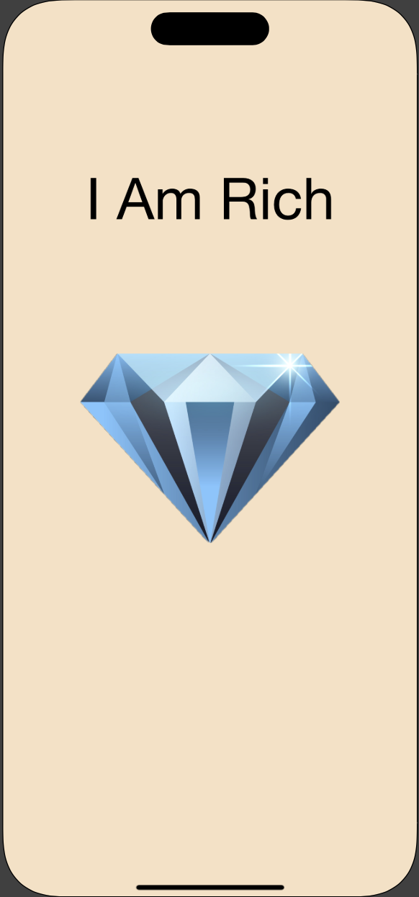

# IAmRich
Inspired by the original I Am Rich app which only showed an image to whoever bought the app on the AppStore
This app is supposed to only show a label and an image, there are no elements that you can interact with.
This is how the app looks:

